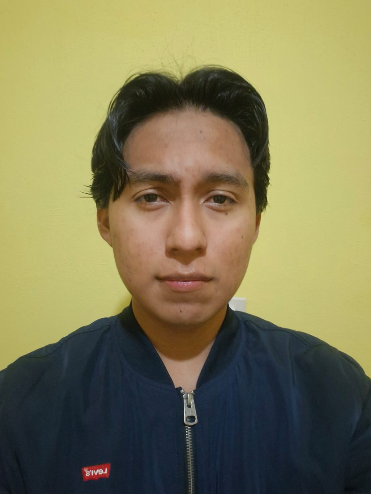

::::::: {.about-page}

[PERFIL ACADÉMICO]{.eyebrow .about-label}

:::::: {.about-layout}

::::: {.about-sidebar}
::: {.profile-placeholder}
{.profile-photo fig-alt="Miguel Angel Ramirez Molina"}
:::

:::: {.profile-card}
[Miguel Angel Ramirez Molina]{.profile-name}

[Ingeniería en Tecnologías de la Información e Innovación Digital]{.profile-degree}

::: {.profile-meta}
Universidad Politécnica de Chiapas

Suchiapa, Chiapas.
:::
::::

:::: {.contact-section}

::: {.contact-heading}
## Contacto {.contact-title}
:::

::: {.contact-list}

[linkedin.com/in/miguel-angel-ramirez](https://www.linkedin.com/in/miguel-angel-ramirez-a98b54436/?isSelfProfile=true){.contact-item .contact-linkedin}

[253418@it2id.upchiapas.edu.mx](mailto:253418@it2id.upchiapas.edu.mx){.contact-item .contact-email}

[253418-m](https://github.com/253418-m){.contact-item .contact-github}

[miguelmolina_tly](https://www.instagram.com/miguelmolina_tly/){.contact-item .contact-instagram}

[Miguel Ramirez Molina](https://www.facebook.com/profile.php?id=100073239982560){.contact-item .contact-facebook}

:::

::::

:::::

::::: {.about-main}

:::: {.about-header}
[ESPACIO PERSONAL / PRESENTACIÓN]{.eyebrow .about-kicker}

# Hola, soy Miguel.

::: {.about-intro}
Soy estudiante de Ingeniería en Tecnologías de la Información e Innovación Digital y utilizo este espacio para documentar conocimientos, proyectos y temas relacionados con la tecnología.

A lo largo de mi formación he explorado distintas áreas como el desarrollo de software, las aplicaciones web y móviles, las bases de datos, las redes, los sistemas operativos y la computación en la nube. Me interesa comprender no solo cómo utilizar una tecnología, sino también cómo se relacionan sus diferentes componentes para construir soluciones organizadas y funcionales.

Este portafolio reúne parte de ese proceso de aprendizaje. Aquí documento proyectos académicos, artículos técnicos y experiencias que me permiten aplicar conceptos vistos durante mi formación y seguir desarrollando nuevas habilidades.
:::
::::

:::: {.interests-section}

## Áreas de interés y exploración

:::: {.interests-grid}

::: {.interest-card}
[01]{.interest-number} Desarrollo de software
:::

::: {.interest-card}
[02]{.interest-number} Desarrollo web y arquitecturas modernas
:::

::: {.interest-card}
[03]{.interest-number} Bases de datos y modelado
:::

::: {.interest-card}
[04]{.interest-number} Redes e infraestructura
:::

::: {.interest-card}
[05]{.interest-number} IA y ciencia de datos
:::

::: {.interest-card}
[06]{.interest-number} Innovación tecnológica aplicada
:::

::::

::::

::: {.personal-manifesto}
> Es mejor hablar y morir que morir sin haber hablado.

[MANIFIESTO PERSONAL]{.manifesto-label}
:::

:::: {.content-cta}

::: {.content-cta-copy}
## Contenido

Artículos, proyectos y aprendizajes publicados
:::

[Explorar contenido →](posts/index.qmd){.button .button-primary}

::::

:::::

::::::

:::::::
