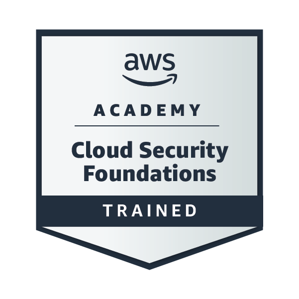
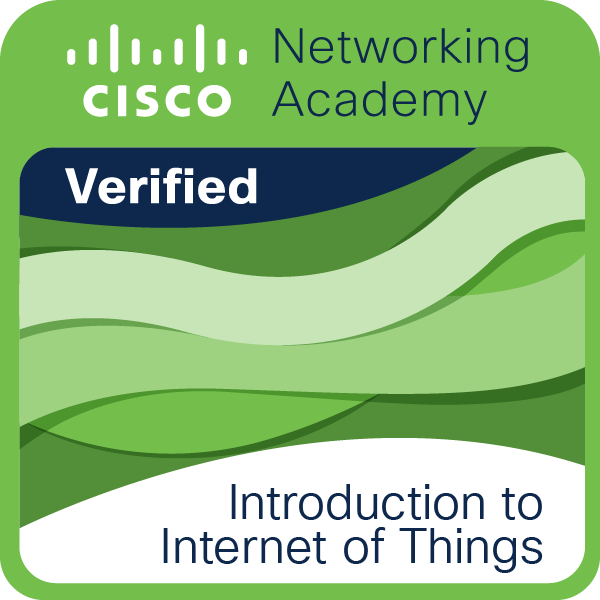
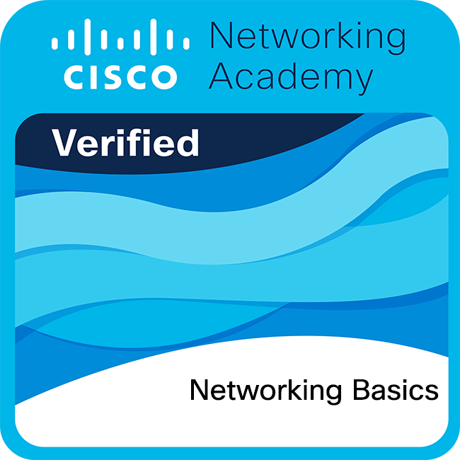
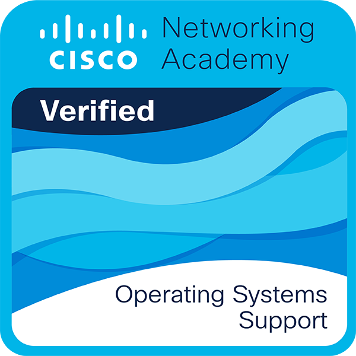
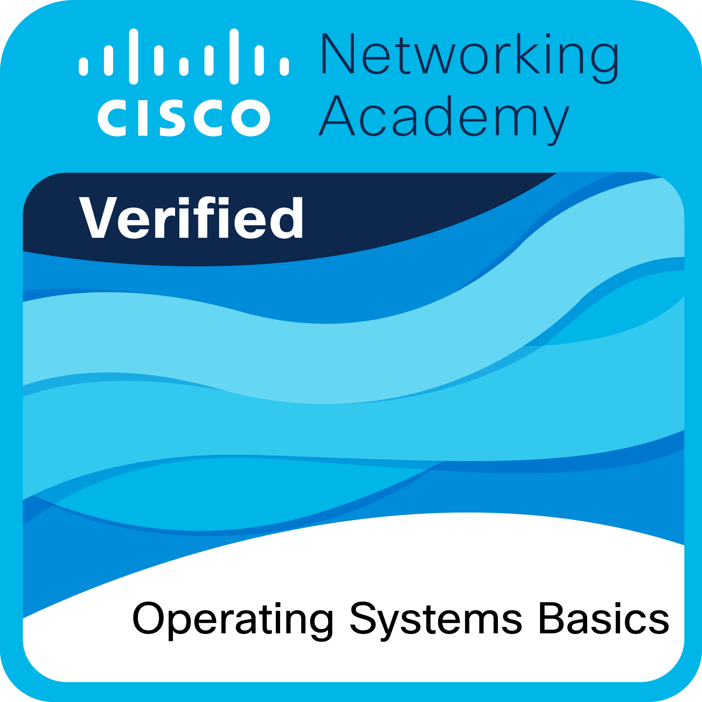

:::: {.hero}
::: {.hero-copy}
[BLOG & PORTAFOLIO]{.eyebrow}

# Miguel Angel [Ramirez Molina]{.name-line}

Desarrollo de software, curiosidad tecnológica y aprendizaje en práctica. Un espacio para compartir proyectos académicos y documentar lo que aprendo en el camino.

::: {.actions}
[Ver más](posts/index.qmd){.button .button-primary}
:::
:::
::: {.hero-photo-wrapper}

::: {.hero-photo-placeholder}
{.hero-photo}
:::
:::
::::

:::: {.section-band}
[PROYECTO INTEGRADOR]{.eyebrow}

## PuraVida

PuraVida es un proyecto de aplicación web desarrollado para una fonda local de Suchiapa, Chiapas. Surge como una propuesta para llevar las actividades del negocio a un entorno digital y contar con una herramienta adaptada a las necesidades de la fonda. El proyecto busca representar una solución tecnológica enfocada en apoyar la operación del establecimiento y ofrecer una experiencia más organizada para el negocio y sus clientes.

::: {.project-grid}
::: {.project-card}
[01 / EL RETO]{.card-kicker}

### Una fonda con procesos cotidianos por digitalizar

PuraVida nace a partir de una necesidad real: organizar en un solo entorno actividades como la publicación del menú, la recepción de pedidos y el registro de ventas.

[Proyecto académico]{.card-type}

:::
::: {.project-card}
[02 / LA PROPUESTA]{.card-kicker}

### Llevar la operación diaria a una plataforma web

El proyecto plantea una aplicación donde los clientes pueden consultar el menú y realizar pedidos, mientras la encargada administra la operación desde un mismo sistema.

[Solución propuesta]{.card-type}
:::
::: {.project-card}
[03 / EL OBJETIVO]{.card-kicker}

### Una experiencia más simple para ambos lados

Más que digitalizar pedidos, PuraVida busca reducir tareas manuales, organizar la información del negocio y facilitar la interacción entre la fonda y sus clientes.

[Impacto esperado]{.card-type}
:::
:::

[Ver más de este proyecto →](blog.qmd){.text-link}
::::

:::::: {.credentials-section aria-labelledby="credentials-title"}

::::: {.credentials-header}

[APRENDIZAJE CONTINUO]{.eyebrow}

## Insignias y certificaciones {#credentials-title}

::: {.credentials-description}
Credenciales obtenidas a lo largo de mi formación que representan conocimientos y habilidades desarrolladas en distintas áreas de la tecnología.
:::

:::::

::::: {.credentials-grid}

:::: {.credential-card}

::: {.credential-image}

::: {.credential-placeholder}
{.credential-badge}

:::
:::

[Computo en la nube]{.credential-category}

::: {.credential-heading}
### AWS Academy Graduate - Cloud Foundations {.credential-title .unlisted}
:::

[AWS Academy]{.credential-issuer}

[Emitida: 28 nov. 2025]{.credential-meta}

::::

:::: {.credential-card}

::: {.credential-image}

::: {.credential-placeholder}
{.credential-badge}
:::
:::

[Internet de las cosas]{.credential-category}

::: {.credential-heading}
### Introducción al Internet de las Cosas {.credential-title .unlisted}
:::

[Cisco Networking Academy]{.credential-issuer}

[Emitida: 28 nov. 2025]{.credential-meta}

::::

:::: {.credential-card}

::: {.credential-image}
::: {.credential-placeholder}
{.credential-badge}

:::
:::

[Redes e infraestructura ]{.credential-category}

::: {.credential-heading}
### Conceptos Básicos de Redes {.credential-title .unlisted}
:::

[Cisco Networking Academy]{.credential-issuer}

[Emitida: 29 oct. 2025]{.credential-meta}

::::

:::: {.credential-card}

::: {.credential-image}

::: {.credential-placeholder}
{.credential-badge}

:::
:::

[Sistemas Operativos]{.credential-category}

::: {.credential-heading}
### Soporte de Sistemas Operativos {.credential-title .unlisted}
:::

[Cisco Networking Academy]{.credential-issuer}

[Emitida: 22 mar. 2026]{.credential-meta}

::::

:::: {.credential-card}

::: {.credential-image}

::: {.credential-placeholder}
{.credential-badge}

:::
:::

[Desarrollo Móvil]{.credential-category}

::: {.credential-heading}
### Aspectos Básicos de Android con Compose {.credential-title .unlisted}
:::

[Google]{.credential-issuer}

[Emitida: 01 oct. 2026]{.credential-meta}

::::

:::: {.credential-card}

::: {.credential-image}

::: {.credential-placeholder}
{.credential-badge}

:::
:::

[Sistemas Operativos]{.credential-category}

::: {.credential-heading}
### Fundamentos de Sistemas Operativos {.credential-title}
:::

[Cisco Networking Academy]{.credential-issuer}

[Emitida: 16 feb. 2026]{.credential-meta}

::::

:::::

::::::

